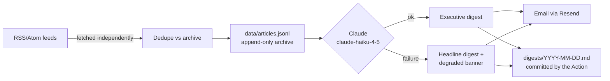

# SectorPulse

**An automated daily industry digest that never fails silently.**

SectorPulse watches a set of industry news sources, archives everything it sees, has
Claude write a short executive digest each morning, and delivers it by email — while
committing every digest to this repo so there's a permanent, browsable record in
[`/digests`](digests/).

This instance is configured for a strategy team tracking the **EV-charging industry**,
but the sources are a five-line config list — point it at any industry.

## How it works

- **GitHub Actions** runs the pipeline daily (12:00 UTC) plus on manual dispatch.
- **No database to babysit**: the archive is a committed, diffable JSONL file
  ([`data/articles.jsonl`](data/articles.jsonl)). Every run rebuilds its index from it,
  so a fresh checkout is all the state the pipeline needs.
- The digest prompt is written for an **executive audience** — what mattered and why,
  grouped by theme, plus a watch list — not a summary of summaries.

## The reliability rules (the actual product)

Most monitoring pipelines fail by going quiet. SectorPulse's contract is
**"watch these sources, tell me what matters, never fail silently"**:

1. **One source failing never kills the run.** Each feed is fetched independently and
   its status is recorded.
2. **Summarization degrades, it doesn't disappear.** If the Claude call fails for any
   reason, you still get the raw headlines — with a visible **"summarization degraded"**
   banner, never a silent gap.
3. **A total blackout sends an alert, not nothing.** If every source fails, you get an
   alert email and the run goes red.
4. **Staleness detection catches quietly-dead feeds.** A source whose newest item is
   7+ days old is flagged inside the digest. Zero new items on a given day is rendered
   neutrally — weekday publishers go quiet on weekends, and that's normal.
5. **The pipeline's health is part of the product.** Every digest ends with a
   per-source status footer, so the reader can see the machinery working (or not)
   without ever opening a log.

### A live demonstration: the dead feed we keep on purpose

One of the five monitored sources — **Green Car Reports** — is deliberately included as
a working exhibit. Its feed still returns HTTP 200 with valid, parseable XML, but it
hasn't published a new item since spring 2025. A naive pipeline would report it
"healthy" forever. SectorPulse flags it in every single digest footer:

> ⚠ **Green Car Reports** — newest item is 468 days old (source quiet — possible feed change or shutdown).

That line is the whole pitch in one sentence: the failure modes you don't see are the
ones that cost you.

## Sample digest

*Excerpt from [the pipeline's first real digest](digests/2026-07-13.md), written by
Claude from that day's items (all digests live in [`/digests`](digests/); when
summarization is degraded the body is headlines-by-source instead):*

> ## What mattered
>
> - **Charging infrastructure: Eviny and Mer merge to create Northern Europe's largest fast-charging network, while Grab plans fifteenfold expansion to 6,000+ ports across Vietnam by 2028.**
>   *Why it matters:* Consolidation in Nordic fast-charging and aggressive buildout in Southeast Asia signal competing regional strategies for market dominance; fragmented networks remain a demand constraint in emerging EV markets. [[1]](https://www.electrive.com/2026/07/10/eviny-and-mer-merge-to-become-northern-europes-largest-fast-charging-provider/) [[2]](https://www.electrive.com/2026/07/10/grab-plans-fifteenfold-expansion-of-its-charging-network-in-vietnam/)
> - **Battery supply and grid integration: BYD secures 11.3 GWh contract for world's largest solar-plus-storage project in Abu Dhabi; EU Battery Booster commits €1.5B in interest-free loans to ramp European cell manufacturing.**
>   *Why it matters:* Stationary storage is becoming a critical revenue stream for battery makers and grid operators; EU policy now targets manufacturing scale-up via capital structure (loans vs. grants) to compete with Chinese dominance. [[1]](https://electrek.co/2026/07/10/byd-masdar-11-gwh-rtc-storage-abu-dhabi/) [[2]](https://chargedevs.com/newswire/european-commissions-battery-booster-to-invest-e1-5-billion-in-the-european-battery-industry/)
> - **Commercial EV infrastructure: Port of Long Beach invests $58.2M in electrified cargo equipment and harbor craft; California school district deploys smart charging and V2G for e-bus fleet via microgrid.**
>   *Why it matters:* Ports and fleet operators are solving grid constraint and duty-cycle challenges through integrated solar-battery-charge architectures, setting template for hard-to-electrify sectors. [[1]](https://chargedevs.com/newswire/port-of-long-beach-invests-58-2-million-to-expand-vehicle-and-equipment-electrification/) [[2]](https://chargedevs.com/newswire/the-mobility-house-enables-smart-charging-and-v2g-for-california-electric-school-bus-fleet/)
>
> **Watch list:** LG Energy Solution's Nanjing expansion for Tesla supply; GM's rumored third EV platform pivot and its competitive implications; sodium-ion battery commercialization (UNIGRID, Alsym) as lithium alternative for stationary and emerging mobile use cases.
>
> ---
>
> ## Pipeline health
>
> | Source | Status | Items in feed | New today | Newest item |
> |---|---|---|---|---|
> | Charged EVs | ✓ ok | 10 | 0 | 2026-07-10 |
> | electrive | ✓ ok | 30 | 0 | 2026-07-11 |
> | Electrek | ✓ ok | 100 | 0 | 2026-07-13 |
> | InsideEVs | ✓ ok | 20 | 0 | 2026-07-12 |
> | Green Car Reports | ⚠ stale | 15 | 0 | 2025-03-31 |
>
> ⚠ **Green Car Reports** — newest item is 468 days old (source quiet — possible feed change or shutdown).

## Stack

Python 3.12 · `feedparser` + `httpx` + `anthropic` (that's the whole dependency list) ·
Claude Haiku 4.5 for summarization · Resend for email · GitHub Actions for scheduling
and auto-commit.

## Run your own

See [DEPLOY.md](DEPLOY.md) — it's a fork, two secrets, and one repo variable.
